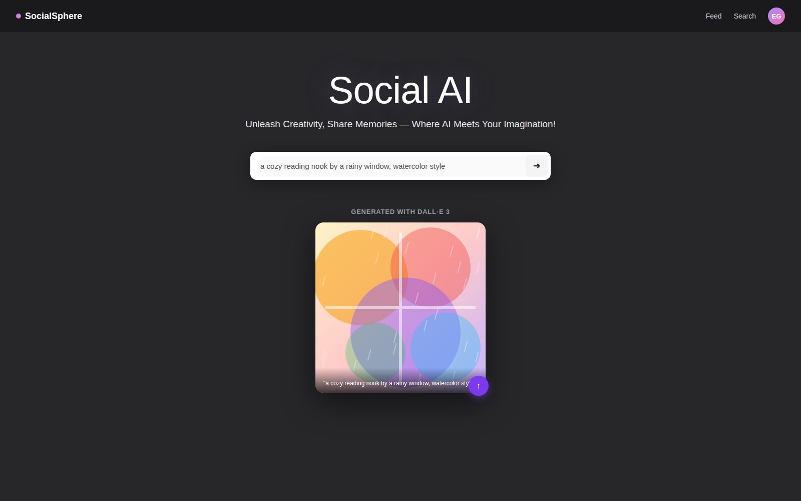

# SocialSphere

**Go REST backend for an AI-powered social network.** A `gorilla/mux` API that uses **Elasticsearch** as both the system of record and the search index, secures routes with **JWT** and **bcrypt**, proxies **OpenAI DALL-E 3** server-side so provider credentials never reach the browser, and re-hosts generated media to **Google Cloud Storage**. A React (Ant Design + MUI) frontend sits on top as a thin client over this API.

What a user sees: sign up, generate an image from a text prompt, post it (or any photo/video), and search posts by keyword or user.



## Highlights

- Built the backend in **Go** with `gorilla/mux`, using **Elasticsearch** as both the primary datastore and the search engine — user documents and posts are indexed on write, so keyword/user search needs no separate query layer.
- Implemented **JWT auth** (`auth0/go-jwt-middleware`) protecting the upload/search/image-generation routes, with public signup/signin endpoints.
- Integrated **OpenAI's DALL-E 3** behind a backend proxy endpoint (`POST /generate-image`) — the frontend calls our own API, our API calls OpenAI with a server-side key, so the key never reaches the browser.
- Wired media uploads to **Google Cloud Storage**, storing the returned public URL on the post document rather than serving files from the API itself.
- Passwords are hashed with **bcrypt** before being written to Elasticsearch — login compares a bcrypt hash, never plaintext.
- All external configuration (Elasticsearch credentials, GCS bucket, JWT signing secret, OpenAI API key) is read from environment variables, documented in `backend/.env.example`.

## Features

- Sign up / sign in (JWT)
- Generate an image from a text prompt (DALL-E 3, via the backend) and post it
- Upload your own image or video as a post
- Browse a photo/video gallery (lightbox view, delete your own posts)
- Search posts by keyword or by user (Elasticsearch)

## Architecture

```
 React (Ant Design + MUI) --- REST/JSON, Bearer JWT ---> Go API (gorilla/mux)
                                                              |  auth0/go-jwt-middleware
                                                              |  Elasticsearch (users, posts, search)
                                                              |  Google Cloud Storage (media)
                                                              |  OpenAI DALL-E 3 (server-side call,
                                                              |    key stays in backend env)
```

## Tech Stack

| Layer | Tech |
|---|---|
| Frontend | React 18, Ant Design, MUI, axios |
| Backend | Go, gorilla/mux, auth0/go-jwt-middleware |
| Search / Data | Elasticsearch |
| Storage | Google Cloud Storage |
| AI | OpenAI DALL-E 3 (called server-side) |
| Infra | Google App Engine (flexible env) |

## Project Structure

```
socialsphere/
├── backend/     # Go REST API
└── frontend/    # React SPA
```

## Getting Started

### Prerequisites

- Go 1.24+, Node.js 18+
- A running Elasticsearch instance
- A Google Cloud Storage bucket + credentials (`GOOGLE_APPLICATION_CREDENTIALS` set per the [GCS Go client docs](https://cloud.google.com/storage/docs/reference/libraries))
- An OpenAI API key with DALL-E access

### 1. Configure the backend

```bash
cd backend
cp .env.example .env
# fill in ES_URL / ES_USERNAME / ES_PASSWORD / GCS_BUCKET / JWT_SECRET / OPENAI_API_KEY
export $(grep -v '^#' .env | xargs)
go run main.go
```

API runs on http://localhost:8080

### 2. Configure the frontend

```bash
cd frontend
npm install
npm start
```

App runs on http://localhost:3000. No frontend env vars are needed for image generation — that key lives on the backend only.

## License

MIT — see [LICENSE](LICENSE)
